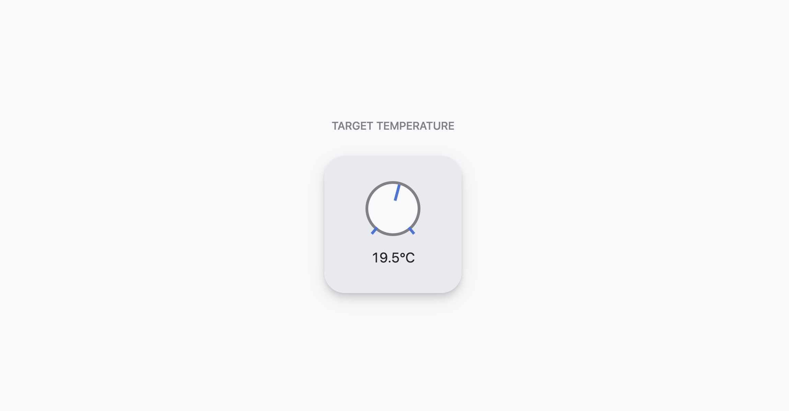

# bnnx-heater

Hello 👋

This is my solution to the coding exercise, built with Vue 3.



## Project Setup

```sh
npm install
```

### Compile and Hot-Reload for Development

```sh
npm run dev
```

### Type-Check, Compile and Minify for Production

```sh
npm run build
```

### Run Unit Tests with [Vitest](https://vitest.dev/)

```sh
npm run test:unit
```
